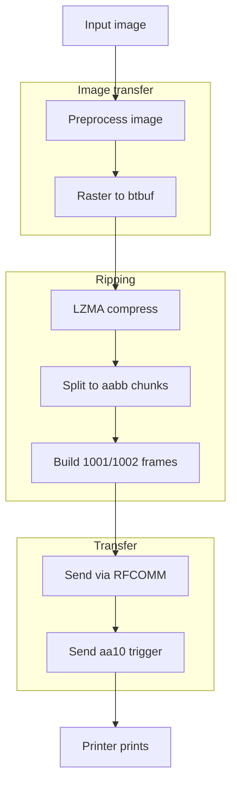
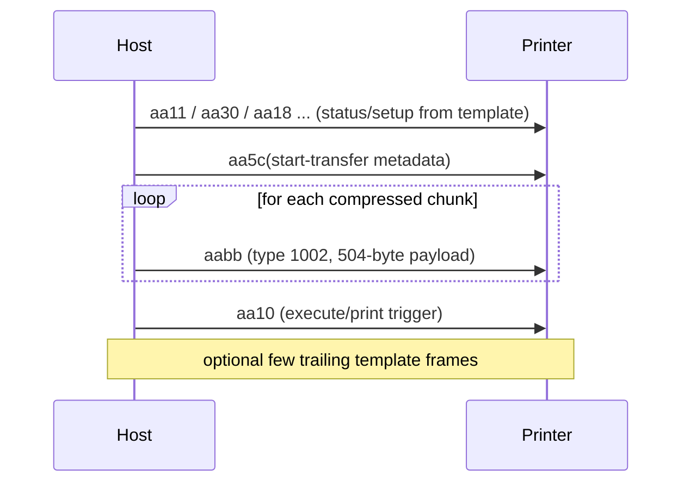

# Protocol Guide (Reverse Engineered)

This document explains the protocol used by this project from two angles:

- practical developer details (how to build frames and send jobs)
- beginner-friendly context (what standards are involved and why)

Scope:

- based on observed traffic and current implementation in `scripts/replay_sender.py`
- some command semantics are inferred, not officially documented by vendor
- protocol discovery and validation were done on Katasymbol E10 (2025 build year)
- currently tested only on that device line/sample

## 1. Big Picture for Newcomers

The printer behaves like a small Bluetooth serial device:

1. Linux opens a Bluetooth RFCOMM socket (serial-over-Bluetooth).
2. The host sends a command sequence (`aa..` commands).
3. Image data is rasterized, packed into a custom buffer (`btbuf`), compressed with LZMA, then chunked.
4. Chunks are transferred as `aabb` messages.
5. A trigger command (`aa10`) starts physical printing.

In short:

`image -> btbuf -> lzma -> aabb chunks -> RFCOMM commands -> print`

## 2. Standards and Building Blocks

This project uses standard Bluetooth transport layers plus a vendor-specific payload protocol.

- `Bluetooth BR/EDR`: classic Bluetooth radio mode (not BLE-only GATT printing)
- `L2CAP`: lower transport layer inside Bluetooth stack
- `RFCOMM`: serial-port emulation on top of L2CAP
- `SDP`: service discovery (used to find Serial Port profile/channel)

What is standard here:

- opening RFCOMM sockets
- pairing/trusting device via BlueZ tools

What is proprietary/custom:

- message payload format (`7e5a ... aa..`)
- command meanings (`aa11`, `aa5c`, `aabb`, `aa10`, ...)
- raster and compression conventions expected by firmware

## 3. End-to-End Flow Diagram

The following diagram is the reference flow for one print job.
Section 4 and Section 5 map directly to these steps.

Group intent:

- `Input image`: user-provided source file
- `Image transfer`: image-side preparation into printer raster format
- `Ripping`: conversion from raster buffer into protocol payload units
- `Transfer`: Bluetooth transport and print trigger
- `Printer prints`: physical output state

## 4. On-Wire Message Structure

Every protocol frame starts with the same envelope header:

- sync: `0x7e 0x5a`
- length: little-endian 16-bit (`len_le16`)
- type: `0x1001` or `0x1002`

### 4.1 Type `0x1001` (generic command frame)

Built by `build_1001(cmd_hex, payload)`:

- `7e5a`
- `len = 4 + payload_len` (little-endian)
- `1001`
- command in big-endian (`aa11`, `aa30`, ...)
- payload bytes

### 4.2 Type `0x1002` (`aabb` data frame)

Built by `build_1002_aabb(payload_504)`:

- `7e5a`
- fixed length `0x01fc` (little-endian)
- `1002`
- command `aabb`
- exactly 504 payload bytes

## 5. Print Session Sequence

The sender replays a captured, known-good sequence and swaps only image-carrying parts.

Important:

- this project intentionally keeps this sequence close to real app captures
- that minimizes firmware rejection risk

## 6. Image Conversion and `btbuf`

The printer does not receive PNG/JPEG directly. It receives a packed monochrome raster buffer (`btbuf`).

Core format fields (current implementation):

- `btbuf[2:4] = 0x100e` (LE)
- `btbuf[4:6] = effective_width` (LE)
- `btbuf[6] = bytes_per_col` (usually 12 => 96 dots head height)
- `btbuf[8:10] = 1`, `btbuf[10:12] = 1`
- `btbuf[12] = no_zero_index` (leading blank-column trim marker)
- `btbuf[14...] = raster bytes`

Raster packing:

- one x-column contains `bytes_per_col` bytes
- each byte represents 8 vertical pixels
- bit order is LSB-first
- black pixel => bit `1`

This gives a compact 1-bit vertical-column stream expected by firmware.

## 7. Checksums and Compression

## 7.1 `btbuf` header checksum

`btbuf[0:2]` holds a sum-based checksum used by the device protocol.
It is computed in `image_to_btbuf_with_canvas(...)`.

## 7.2 LZMA encoding

`btbuf` is compressed in "LZMA alone" format with:

- filter `LZMA1`
- dictionary `8 KiB`
- `lc=3`, `lp=0`, `pb=2`, `mode=normal`, `nice_len=128`, `mf=bt4`

## 7.3 `aabb` chunk checksum

Compressed stream is split into 500-byte parts.
Each part goes into a 504-byte payload:

- `[2] = chunk index`
- `[3] = chunk count`
- `[4...] = data`
- `[0:2] = sum(payload[2:504]) & 0xffff` (LE)

## 8. Template-Dependent Behavior

Two template values influence output strongly:

- `width`
- `no_zero_index`

With `--use-template-nozero`:

- canvas width uses `template_width + template_no_zero_index`
- `btbuf[12]` is forced from template
- left-shift behavior better matches firmware expectations seen in captures

This is one reason replaying against a known template is currently more reliable than "from scratch" generation.

## 9. Command Families Seen So Far

Observed command IDs in print jobs:

- `aa11`, `aa30`, `aa18`: frequent polling/state commands
- `aad0`, `aad1`: transfer setup/blocks
- `aab0`, `aac9`, `aa13`, `aaba`: mode or state transitions
- `aa5c`: transfer metadata/start
- `aabb`: compressed image chunks
- `aa10`: print trigger

Caution:

- exact semantic names are inferred from behavior
- keep captures/logs when extending support for other printer variants

## 10. How to Build Your Own Driver from This

Minimal recipe:

1. Open RFCOMM connection to printer channel.
2. Send pre-transfer command sequence similar to known-good capture.
3. Convert input image to 1-bit vertical-column raster (`btbuf` layout above).
4. LZMA-compress with matching parameters.
5. Chunk into 504-byte `aabb` payloads and send each in `0x1002` envelope.
6. Send `aa10` trigger.
7. Optionally poll status (`aa11` style) around transfer/print phases.

If your own implementation fails intermittently, compare:

- exact bytes sent for `aa5c`, `aabb`, `aa10`
- timing gaps between frames
- template-dependent fields (`width`, `no_zero_index`)

## 11. Validation and Tooling in This Repo

- `scripts/decode_spp.py`: extracts outgoing messages from captures
- `scripts/decode_lzma_btbuf.py`: decodes `aabb` payloads back to raster
- `scripts/replay_sender.py`: canonical sender implementation for this repo

Use `send_log.json` and `meta.json` from `out/replay_sender/<timestamp>/` for regression checks.

## 12. Known Limits

- No official vendor spec available.
- Firmware can enter unstable/frozen states on some failures.
- Pairing/connect behavior can differ across adapters and OS configs.
- Command semantics may differ slightly across printer firmware generations.

For operational failure handling, see [docs/TROUBLESHOOTING.md](TROUBLESHOOTING.md).
