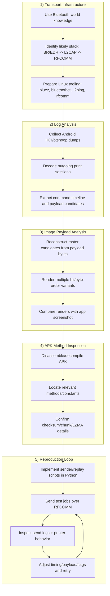
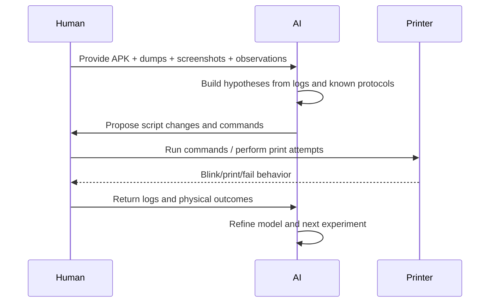

# Reverse Engineering HowTo

This document describes how this project was built in practice, step by step.
It is not only a technical recipe, but also a collaboration model between human and AI.

## Scope and Intent

- Goal: achieve Linux interoperability with the printer, not clone vendor software.
- Legal framing: interoperability-focused reverse engineering only.
- Device scope for this work: Katasymbol E10 (build year 2025), single tested device line.

## Process Overview

The workflow had five main phases:

1. Understand transport infrastructure from general Bluetooth knowledge.
2. Analyze captured logs.
3. Decode and verify image payload encoding from logs.
4. Increase precision by inspecting app methods and constants.
5. Iterate reproduction attempts in a human+AI loop until real prints worked.

## End-to-End Workstream

## Human + AI Collaboration Loop

## Practical Method Details

## 1) Transport Infrastructure First

Before touching payload internals:

- verify adapter state and discovery
- verify link reachability (`l2ping`)
- verify RFCOMM connectability

Reason:

- if link-layer is unstable, protocol debugging signals are noisy and misleading

## 2) Log-First Protocol Recovery

Use captured sessions as truth baseline:

- extract command order
- detect state polling patterns
- isolate large payload-bearing commands (`aad1`, `aabb`)

Treat captures as source of truth, not assumptions.

## 3) Image Encoding Recovery via Visual Verification

Payload bytes alone are ambiguous.
To remove ambiguity:

- generate many render variants (bit order, inversion, width assumptions)
- compare outputs with known app-produced visuals/screenshots
- keep only variants that align visually

This yielded robust confidence in raster packing choices.

## 4) APK Inspection for Precision

Logs gave structure; APK inspection improved parameter precision:

- checksum formulas
- chunk headers
- LZMA-related constants
- edge behaviors around offsets/no-zero-index style fields

Rule used in this project:

- if log evidence and method evidence conflict, re-test and keep both as `inferred` until validated by successful print

## 5) Iterative Reproduction in Real Hardware Loop

The reproduction stage required many real attempts:

- send candidate sequence
- collect `send_log.json` and printer behavior
- adjust one variable at a time (timing, payload mode, template behavior)
- retry

Success criterion:

- printer emits expected physical print pattern, not only protocol-level ACKs

## Reliability Notes

- "Protocol accepted" does not always mean "paper printed".
- A run can be byte-correct but fail due to firmware/device state.
- Keep a known-good baseline and compare every new run against it.

## Evidence Discipline (Recommended)

For each experiment, store:

- command used
- `meta.json`
- `send_log.json`
- generated payload artifacts (`btbuf`, `aabb`)
- physical observation summary (blink count, print/no print, shutdown behavior)

This is critical for reproducibility and future porting.

## Recommended Labels in Future Work

Use explicit confidence tags in docs and code comments:

- `observed`: directly seen in logs/device behavior
- `confirmed`: observed + successful print validation
- `inferred`: likely, but not yet fully validated

## Why This HowTo Exists

This repository is intentionally context-rich so future maintainers (human or AI) can continue quickly:

- understand what is known
- understand what is guessed
- reproduce and extend with minimal repeated discovery work
